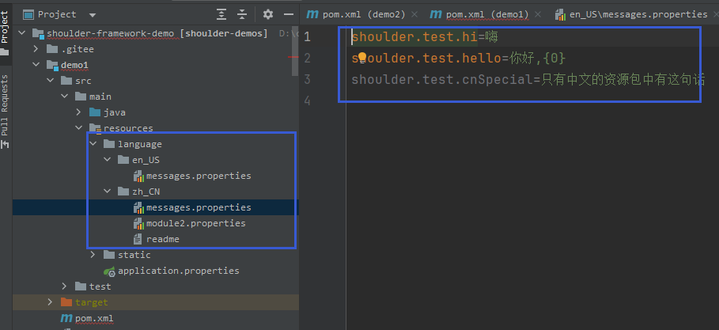
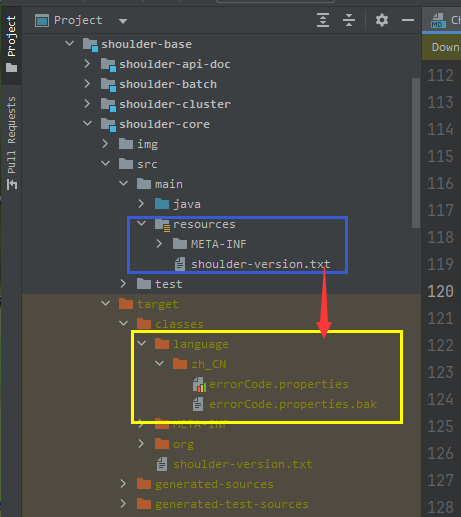

<h1 align="center"><a href="https://github.com/ChinaLym/shoulder-plugins" target="_blank">Shoulder Plugins</a></h1>

[](https://github.com/ChinaLym/shoulder-framework)
[](https://github.com/ChinaLym)
[](https://github.com/ChinaLym/shoulder-framework)

[](https://github.com/ChinaLym/shoulder-plugins)

# 📖 INTRODUCE [中文_Chinese](README_ZH)
a maven plugin which can **generate manuals of error code info and i18n resource files automatically**.

technical under [shoulder-framework](https://github.com/ChinaLym/shoulder-framework) [shoulder-core i18n](https://github.com/ChinaLym/shoulder-framework/blob/master/shoulder-build/shoulder-base/shoulder-core/README.md#%E7%BF%BB%E8%AF%91%E4%B8%8E%E5%A4%9A%E8%AF%AD%E8%A8%80).

---

# 🚀 Quick Start

add dependency to your project
```
    <build>
        <plugins>
        
            <!-- shoulder plugin -->
            <plugin>
                <groupId>cn.itlym.shoulder</groupId>
                <artifactId>shoulder-maven-plugin</artifactId>
                <version>1.2.1</version>
                <executions>
                    <execution>
                        <!-- active plugin when mvn complie -->
                        <phase>compile</phase>
                        <goals>
                        <!-- enable generate error code info-->
                            <goal>generateErrorCodeInfo</goal>
                        </goals>
                    </execution>
                </executions>
            </plugin>
            
        </plugins>
    </build>
```

More user cases see [plugin introduce](plugins/errcode-maven-plugin/README.MD).

### Ability

- generate i18n resource files according to code comments to support multi language.
- generate manuel of error code to error code query system which aimed support clients query reason or suggestion of an error code. 
- ....

### Example

1. See [handmade i18n resource files](https://github.com/ChinaLym/shoulder-framework-demo/blob/main/demo1/src/main/resources/language/zh_CN/messages.properties)  in [shoulder-framework-demo1](https://github.com/ChinaLym/shoulder-framework-demo/tree/main/demo1).
   

2. See automatically generated i18n resource files in [shoulder-framework](https://github.com/ChinaLym/shoulder-framework/blob/master/shoulder-build/shoulder-base/shoulder-core/pom.xml).

> `shoulder-core` used this plugin，it will generated i18n resource files and error code files automatically while `mvn compile`.



# ❓ FAQ

**Q:** What is [shoulder-framework](https://github.com/ChinaLym/shoulder-framework)?
- **A:** a fantastic framework based on [Spring BOOT](https://github.com/spring-projects/spring-boot).

# 💗 Contribute

It's open for contribution，`code format`, `java doc`, `comment`, `bugfix`, `new feature`，See more in [How to contribute](CONTRIBUTING.MD).

# 🤝🏼 Contact us

Thanks for your **[Star](https://gitee.com/ChinaLym/shoulder-framework/star)** 、 **Fork** 、 **PR**.

Contact us with `github issue` or [email to cn_lym@foxmail.com](mailto:cn_lym@foxmail.com), waiting for any suggestions or discussion~
