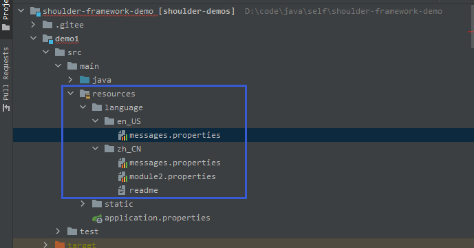
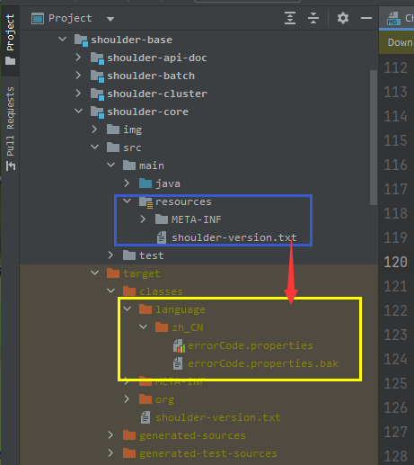

# shoulder-plugins

## 简介
[shoulder-framework](https://github.com/ChinaLym/shoulder-framework) (A useful framework based on [Spring BOOT](https://github.com/spring-projects/spring-boot)) 中[多语言部分](https://github.com/ChinaLym/shoulder-framework/blob/master/shoulder-build/shoulder-base/shoulder-core/README.md#%E7%BF%BB%E8%AF%91%E4%B8%8E%E5%A4%9A%E8%AF%AD%E8%A8%80)的插件.

### 功能说明

引入本插件后，在 maven 打包时，自动生成错误码的相关信息（多语言翻译、error message不同环境的说明），供其他软件/程序读取或使用。

- 根据代码的注释信息生成多语言对应的 key，供翻译能力读取（为什么不在代码中：配置文件方式方便修改）
- 可检索所有错误码，供统一索引，如提供错误码统一查询平台，根据错误码查询原因和建议
- ....


### 使用说明

在项目中引入以下插件
```
    <build>
        <plugins>
        
            <!-- shoulder 错误码插件 -->
            <plugin>
                <groupId>cn.itlym.shoulder.plugins</groupId>
                <artifactId>errcode-maven-plugin</artifactId>
                <version>0.0.1-SNAPSHOT</version>
                <executions>
                    <execution>
                        <!-- 编译时触发该插件 -->
                        <phase>compile</phase>
                        <!-- 使用该插件的生成错误码信息功能 -->
                        <goals>
                            <goal>generateErrorCodeInfo</goal>
                        </goals>
                    </execution>
                </executions>
            </plugin>
            
        </plugins>
    </build>
```

### 效果

1. 去 [shoulder-framework-demo1](https://github.com/ChinaLym/shoulder-framework-demo/tree/main/demo1) 中查看demo中`人工`写法 [翻译文件](https://github.com/ChinaLym/shoulder-framework-demo/blob/main/demo1/src/main/resources/language/zh_CN/messages.properties) 的翻译文件，打包时自动打进jar里


2. 去 [shoulder-framework](https://github.com/ChinaLym/shoulder-framework/blob/master/shoulder-build/shoulder-base/shoulder-core/pom.xml) 查看框架中`自动生成`的使用

> shoulder-core 引入该插件后，编译时，会自动生成以下用于展示多语言错误码提示的文件。



### 参与贡献

1.  Fork 本仓库
2.  新建 issue/{issue对应编号} 分支
3.  提交代码
4.  新建 Pull Request

5.  新模块命名：该项目是 shoulder 协助插件，故主要与shoulder相关，groupId需要携带shoulder，举例：
```xml
<groupId>org.jetbrains.kotlin</groupId>
<artifactId>kotlin-maven-plugin</artifactId>

<groupId>org.apache.maven.plugins</groupId>
<artifactId>maven-compiler-plugin</artifactId>
```